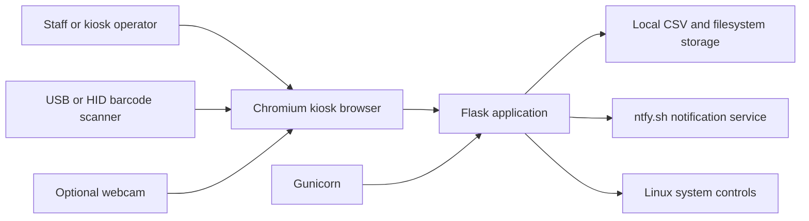
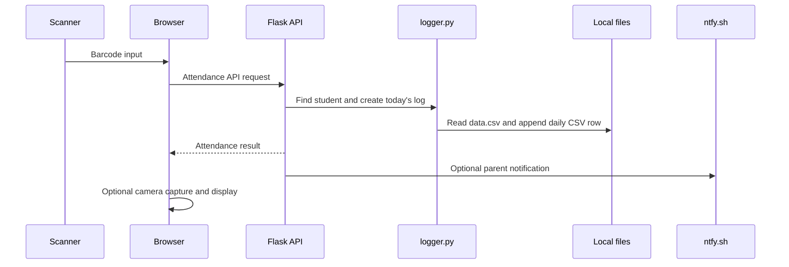

# CVAFPI Identification System Architecture

## Purpose

The CVAFPI Identification System is a Linux kiosk application for barcode-based attendance and access verification. It provides a browser-based operations console for scanning IDs, managing student records, reviewing attendance logs, importing CSV data, configuring branding and notifications, and performing protected kiosk controls.

The application is primarily a Flask application backed by CSV files and the local filesystem. It is designed to run on one kiosk computer, with optional outbound notifications through ntfy.sh.

## System Context



## Runtime Components

### Flask application: `app.py`

`app.py` owns the application and HTTP API:

- Serves the HTML pages in `templates/` and assets in `static/`.
- Exposes page routes for the launchpad, scanner, student manager, log manager, and migration UI.
- Exposes JSON APIs for attendance, student records, log retrieval, settings, branding, security, notifications, and kiosk system actions.
- Loads configuration from `settings.json` and uses `CVAFPI_DATA_DIR` as the writable data root when set.
- Delegates CSV, attendance-log, audit, and cleanup operations to `logger.py`.
- Sends parent and office notifications asynchronously through HTTPS requests to ntfy.sh.

### WSGI entry point: `wsgi.py`

`wsgi.py` imports and exposes `app` from `app.py`. Production startup uses this module with Gunicorn:

```bash
gunicorn --bind 0.0.0.0:5000 --workers 1 --threads 4 --timeout 120 wsgi:app
```

The single-worker configuration is important because the application writes shared CSV files directly and is intended for one kiosk instance.

### File and log service: `logger.py`

`logger.py` is the persistence and maintenance module. It:

- Reads and writes the primary student registry in `data.csv`.
- Mirrors student writes to `backup-data.csv`.
- Creates one attendance directory per day under `CVA_Database/`.
- Appends attendance rows to `CVA_Database/logs_YYYY-MM-DD/logs_YYYY-MM-DD.csv`.
- Writes administrative and security events to `logs/audit_events.csv`.
- Parses and validates uploaded student CSV files for preview, merge, or replacement imports.
- Runs seven-day cleanup at module initialization and removes expired dated log directories, including snapshots stored there.

### Browser UI

The HTML pages are server-rendered by Flask and use browser-side JavaScript for API calls and interaction:

- `launchpad.html`: operations console and protected system controls.
- `scanner.html`: barcode attendance workflow and optional camera capture.
- `manager.html`: student record administration.
- `logs-manager.html`: attendance and audit-log review, including snapshots.
- `migration.html`: CSV validation, preview, merge, and replacement import.
- `kiosk-dialog.js` and `kiosk-dialog.css`: shared kiosk dialogs and styling.

`jsbarcode.js` provides offline barcode rendering for the UI.

### Auxiliary Node server: `server.js`

`server.js` is a separate Express server on port 3000 by default. It serves project files and contains simple endpoints for CSV log listing and viewing. The documented production launcher uses Flask/Gunicorn on port 5000, so the Node server should be treated as an auxiliary or legacy server unless an operator explicitly starts it.

## Request and Data Flows

### Attendance scan



The daily attendance row stores the timestamp, barcode, student details, access type, color, and a generated snapshot filename. The snapshot itself is stored in the corresponding dated database directory when camera capture is enabled.

### Student registry updates

The registry is a CSV-backed map keyed by barcode. Manager operations and migration imports load the current records, apply changes in memory, then rewrite both `data.csv` and `backup-data.csv` with the common schema:

```text
BARCODE,NAME,GRADE,SECTION,ACCESS,COLOR,NTFY_TOPIC
```

There is no relational database, ORM, or external persistence service. Concurrent manual edits to the CSV files while the server is active are unsupported.

### Settings and branding

`settings.json` stores feature flags, institution branding, notification topics, command barcodes, and security metadata. Public settings APIs exclude password hashes and salts. A custom logo is stored as `static/custom-logo.png` under the configured data root and copied into the packaged static directory when needed.

## Security Boundaries

- Protected actions require the configured passcode, including system controls and sensitive administration operations.
- Passcodes and security answers are stored as PBKDF2-HMAC-SHA256 hashes with per-value salts.
- Public settings responses exclude `pin_hash`, `pin_salt`, `security_answer_hash`, and `security_answer_salt`.
- Uploaded and imported CSV data is validated before import; required fields include `BARCODE` and `NAME`.
- Log filename lookup in the Node server is reduced to a basename before constructing a path.
- Kiosk command barcodes can invoke shutdown, restart, exit, or navigation actions, so printed command barcodes must be physically controlled.
- Notification topics and tokens are operational secrets and must not be committed or exposed.
- The kiosk account may require passwordless sudo for hardware and system actions; this is a deployment risk that should be limited to the dedicated kiosk environment.

## Storage Layout

```text
BASE_DIR/
├── data.csv                         Primary student registry
├── backup-data.csv                 Mirrored student registry
├── settings.json                   Runtime settings and security metadata
├── logs/
│   └── audit_events.csv            Administrative and security audit events
├── CVA_Database/
│   └── logs_YYYY-MM-DD/
│       ├── logs_YYYY-MM-DD.csv     Daily attendance records
│       └── *.jpg                   Optional scan snapshots
└── static/
    └── custom-logo.png             Optional uploaded institution logo
```

`BASE_DIR` defaults to the project directory and can be changed with the `CVAFPI_DATA_DIR` environment variable. The source templates and static assets remain available through the application resource directory, which also supports packaged execution through `sys._MEIPASS`.

## Deployment and Operations

1. Install the Python dependencies from `requirements.txt` in a fresh virtual environment.
2. Use the project launcher (`CVAFPI IDENTIFICATION SYSTEM.sh`) or start Gunicorn through `wsgi:app`.
3. Run the kiosk browser against the Flask service on port 5000.
4. Keep the kiosk on a trusted, preferably wired network.
5. Use the web migration and manager interfaces for registry changes while the server is running.
6. Monitor `logs/audit_events.csv` and the dated attendance directories for operational issues.
7. Keep regular copies of `data.csv`, `backup-data.csv`, `settings.json`, and required logs according to the institution's retention policy.

## Architectural Constraints and Risks

- CSV and filesystem writes are simple and transparent but are not suitable for multi-kiosk concurrent writes or high-volume multi-user deployments.
- The single Gunicorn worker reduces write races but does not provide a distributed locking or transaction mechanism.
- The application has no built-in authentication session layer; authorization is implemented with passcode checks on protected requests.
- ntfy.sh is an external dependency for notifications. Attendance recording should remain local if notification delivery fails.
- Seven-day cleanup is executed when `logger.py` is imported, so retention depends on the application process starting regularly.
- `server.js` and Flask expose overlapping file-serving concepts. Operators should choose one documented runtime path rather than running both as interchangeable production servers.

## Extension Guidelines

When extending the system:

- Keep persistence changes in `logger.py` and route/request orchestration in `app.py`.
- Preserve the student CSV schema and update both primary and backup files for registry writes.
- Add audit events for security-sensitive or administrative operations.
- Do not return secret settings through public APIs.
- Keep browser pages dependent on stable Flask API contracts rather than reading storage files directly.
- Add focused tests around CSV parsing, import modes, passcode protection, cleanup, and attendance logging when changing those behaviors.
