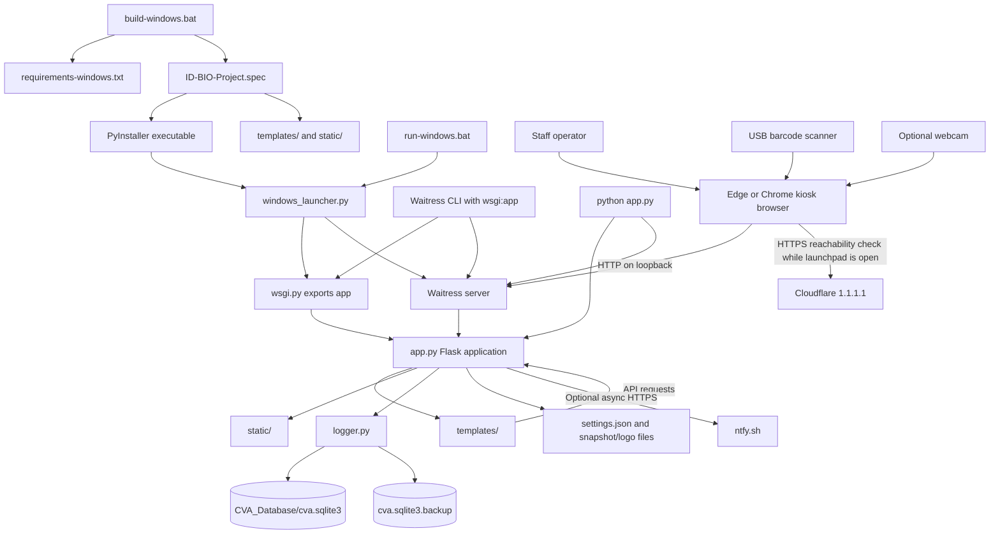

# CVAFPI Identification System Architecture

## 1. Purpose and scope

CVAFPI Identification System is a local-first school identification, attendance, and kiosk application. It provides a browser interface for scanning student IDs, maintaining student records, reviewing attendance and audit events, importing student lists, and configuring kiosk behavior.

The application is designed for a single Windows kiosk computer. The HTTP server listens on the loopback interface (`127.0.0.1`) in the supported launch paths; student and attendance data are stored locally in SQLite. Optional notifications are sent to the external NTFY service when configured. The application is not designed as a public website, a multi-tenant service, or a network-accessible student-information system.

This document describes the current implementation. For end-user operating procedures and Windows packaging steps, see [README.md](README.md).

## 2. Architecture at a glance



The key boundaries are:

- **Browser UI:** Pages under `templates/` and shared assets under `static/`. Browser code handles input, display, dialogs, camera capture, and calls the local API.
- **HTTP and WSGI:** Flask owns request routing and validation. Waitress serves the WSGI application in Windows kiosk startup, server-only runs, and direct `python app.py` startup.
- **Persistence:** `logger.py` owns SQLite schema initialization and most student, attendance, audit, import, and backup operations. `app.py` owns filesystem operations for settings and image assets.
- **External integration:** Parent and office notifications are optional outbound HTTPS requests to NTFY. The launchpad also makes a browser-side HTTPS reachability check to Cloudflare while it is open; this check does not pass through Flask and sends no student data.

### Repository connections

The main source and build relationships are:

```text
build-windows.bat
    +-- installs requirements-windows.txt
    +-- runs PyInstaller with ID-BIO-Project.spec
                +-- bundles windows_launcher.py as the executable entry point
                +-- bundles templates/ and static/ as resources
                +-- collects Pillow submodules for logo conversion

run-windows.bat
    +-- sets CVAFPI_DATA_DIR and activates .venv-windows
    +-- runs windows_launcher.py

windows_launcher.py
    +-- starts Waitress with the WSGI callable from wsgi.py
    +-- opens the browser at the local Waitress address

wsgi.py -> app.py -> logger.py -> SQLite database / database backup
                                    +-> templates/ and static/ -> browser API requests to app.py
                                    +-> settings.json / snapshot files / uploaded logo
                                    +-> optional NTFY HTTPS requests
```

`app.py` is the connection point between HTTP requests and the rest of the application. Its page routes call `render_template()`, its API routes validate input and invoke `logger.py` or filesystem/network operations, and its context processor supplies the institution name, notification topic prefix, theme, accent color, and logo URL to rendered pages. The template/static roots are selected from the source tree or the PyInstaller resource directory; writable data paths are selected separately through `CVAFPI_DATA_DIR`.

There is no shared template base file or JavaScript bundler. Each page owns its main HTML, page-specific CSS, and page-specific JavaScript. Reuse between pages is through HTTP endpoints, Jinja context values, and the shared static dialog files.

## 3. Main components

| Component | Responsibility |
| --- | --- |
| `app.py` | Flask application object, page routes, API routes, security checks, settings, image upload and snapshot handling, notifications, and system commands. |
| `wsgi.py` | Exposes `app` as the WSGI callable imported by Waitress. It contains no server logic. |
| `windows_launcher.py` | Sets the writable data directory, starts Waitress on loopback, waits for the server, launches Edge or Chrome in kiosk mode, and keeps the server alive. |
| `logger.py` | Initializes SQLite, persists students/attendance/audit/settings, imports CSVs, applies the scan duplicate window, creates backups, and prunes old snapshot directories. |
| `templates/` | Launchpad, attendance scanner, student manager, logs manager, Audit Manager, and CSV migration pages. |
| `static/` | Shared browser JavaScript and CSS, local barcode generation library, and optional custom logo. |
| `settings.json` | Human-readable settings and passcode/recovery hashes. Values are also stored in the SQLite `app_settings` table. |
| `CVA_Database/cva.sqlite3` | Primary student, attendance, settings, and audit database. |
| `CVA_Database/cva.sqlite3.backup` | Latest consistent SQLite backup, replaced atomically after database writes. |
| `CVA_Database/logs_YYYY-MM-DD/` | Scan photos and blocked-camera snapshots, grouped by local date. |
| `ID-CODES FOR SYSTEM/` | Printable barcode image files for staff. They are not read by Flask at runtime or bundled by the current PyInstaller specification. |
| `LICENSES/` | Project and third-party notices, including the license for the vendored JsBarcode file. |

### Browser page to API map

| Page/file | Browser-side responsibilities | Connections to Flask/API | Shared/local assets |
| --- | --- | --- | --- |
| `templates/launchpad.html` | Main navigation, live clocks, settings modal, branding/theme controls, confirmations, and protected restart/shutdown/exit controls. Saving settings requests the current passcode through the shared prompt. It also handles the `?settings=1` link used by the settings command barcode. | Reads `GET /api/settings` and `GET /api/security/config`; writes `POST /api/settings`; uploads `POST /api/branding/logo`; uses `POST /api/security/recover`, `/api/system/reboot`, `/api/system/shutdown`, and `/api/exit`. | Loads `static/ping.js` for its browser-side Cloudflare reachability check, plus `kiosk-dialog.css` and `kiosk-dialog.js`; institution/theme/logo values come from the Flask context processor. |
| `templates/scanner.html` | Receives keyboard-wedge/manual scans, manages the last-scan card and today's table, asks for camera permission when enabled, analyzes camera frames, and renders the student's barcode. Focusing the barcode field exits search mode and dismisses its notice. | Reads `GET /api/settings` and `GET /api/logs/today`; posts scans to `POST /api/scan`; reports blocked-camera state to `POST /api/camera/blocked`; completes a returned command via `POST /api/system/command`. | `JsBarcode.all.min.js` is loaded locally and used for the card barcode. Shared dialog CSS/JS handles alerts and passcode prompts. |
| `templates/manager.html` | Loads/filter students, edits the right-side form, asks for confirmation and passcode before delete/save, and refreshes the list after mutations. | Reads `GET /api/data`; writes `POST /api/save_student` and `POST /api/delete_student`. | Shared dialog CSS/JS provides confirmations, alerts, and passcode prompts. |
| `templates/logs-manager.html` | Loads available dates and attendance rows, applies text/time filters, calculates KPIs, previews snapshots, exports the filtered data as CSV in the browser, and shows the legacy Audit Events modal. | Reads `GET /api/logs/list`, `/api/logs/today`, `/api/logs/view`, and `/api/logs/snapshot`; loads audit rows with `POST /api/audit/events`. | Shared dialog CSS/JS prompts for audit access. The export CSV is generated in browser memory, not a server-side log file. |
| `templates/audit-manager.html` | Prompts on entry, searches audit rows locally, parses snapshot metadata from event details, and opens/closes the snapshot viewer. | Loads `POST /api/audit/events`; snapshot images are fetched from `GET /api/logs/snapshot`. | Shared dialog CSS/JS handles passcode and error dialogs. |
| `templates/migration.html` | Implements a three-stage choose/review/import flow using `FormData`, shows preview counts/sample rows, and keeps the selected CSV in the browser until import. | Reads `GET /api/migration/status`; posts `POST /api/migration/preview` and `POST /api/migration/import`. | Uses shared dialog CSS/JS for the import passcode prompt. Its page logic is inline; it is not a separate JavaScript bundle. |

### Shared browser assets and reference files

- Each of the six page templates links `/static/kiosk-dialog.css` and loads `/static/kiosk-dialog.js`. The JavaScript creates the shared modal and exports `appAlert()`, `appConfirm()`, and `appPrompt()` to page scripts. The CSS styles those controls and explicitly keeps elements with the HTML `hidden` attribute hidden.
- `templates/launchpad.html` alone loads `/static/ping.js`. It makes a cache-bypassing, no-CORS HTTPS request to `https://1.1.1.1/cdn-cgi/trace` every five seconds, applies a four-second timeout, and shows Online when the request resolves or Offline when it fails. It stops polling on `pagehide` and restarts when restored from the browser back-forward cache. This is an endpoint reachability signal, not an ICMP ping or a guarantee that other services are reachable.
- `templates/scanner.html` loads `/static/JsBarcode.all.min.js` before its inline application script. That library produces the visual barcode on the last-scanned student card; scanner input itself is supplied by the keyboard-wedge reader and does not depend on JsBarcode.
- `static/CVAFPI-LOGO.png` is the default institution logo. A custom logo is written to `BASE_DIR/static/custom-logo.png`; the context processor selects the custom URL when it exists and each template falls back to the packaged logo if its image fails to load.
- `ID-CODES FOR SYSTEM/` contains printable PNGs. The application does not enumerate these files. A scanned value is recognized as a system action only when it equals one of the configured barcode values in `app.py` settings; the PNG artwork is therefore an operator aid, not executable configuration.
- `LICENSES/jsbarcode_MIT_LICENSE.txt` applies to the locally bundled JsBarcode distribution. PyInstaller includes `static/` but does not include the separate `ID-CODES FOR SYSTEM/` folder or the mutable database directory through the `datas` list in the current spec.
- `.gitignore` excludes writable databases, SQLite WAL sidecars, uploaded custom logos, virtual environments, build outputs, and kiosk browser profiles so runtime state is not treated as source code.

The system-code artwork currently present is:

| Image | Connection to configured command |
| --- | --- |
| `CD=CLOSEBARCODESYS96%&@CVAFPI.png` | Matches the default `close_kiosk_barcode`. |
| `CD=EMERSHUTDOWNSYSSU62#9CVAFPI.png` | Matches the default `shutdown_barcode`. |
| `CD=BARCODESYS2#2736#CVAFPI.png` | Has no matching command setting in the current defaults; it is not interpreted specially unless an administrator configures a matching value. |

The other default command values (return to launchpad, open Student Manager, open Logs Manager, and open Settings) are configured in `app.py`/`settings.json` but have no corresponding PNG in this directory. These values can be changed from the launchpad's System Settings modal. The form submits the close/shutdown/launchpad values directly; a page-level `fetch` wrapper adds the database-manager, logs-manager, and settings values before the request reaches `POST /api/settings`.

`logs/` at the data root is created as an auxiliary directory. Scanner and blocked-camera images are actually written under `CVA_Database/logs_YYYY-MM-DD/`; the two locations are not interchangeable. `logger.py` currently emits diagnostics with `print()` rather than writing application diagnostics into the root `logs/` directory.

`LICENSES/LICENSE` is the project license text. There is no Node package manifest or frontend build step in the application path: browser JavaScript is served directly from `static/` or embedded in its page template. A workspace `node_modules/` directory is not required to launch the Flask/Waitress application.

## 4. Application startup and serving

### 4.1 WSGI application

`wsgi.py` imports the Flask application from `app.py` and exports it as `app`. A WSGI server imports this callable and dispatches HTTP requests to Flask. The supported server is Waitress, supplied by `requirements-windows.txt`.

```text
HTTP request -> Waitress -> wsgi:app -> Flask route -> logger/filesystem -> HTTP response
```

Waitress is used because it is a production-capable WSGI server that runs on Windows. Flask's built-in development server is not used by the current direct or packaged startup paths.

### 4.2 Windows kiosk startup

`run-windows.bat` changes to the repository directory, sets `CVAFPI_DATA_DIR` to that directory, activates `.venv-windows`, and runs `windows_launcher.py`.

`windows_launcher.py` then:

1. Reads `CVAFPI_PORT`, defaulting to `5000`.
2. Sets `CVAFPI_DATA_DIR` to the application directory if it was not already set.
3. Imports Waitress and `wsgi.app`.
4. Starts Waitress in a server thread on `127.0.0.1`, using four request threads.
5. Waits for the local TCP port to accept connections.
6. Launches Microsoft Edge if available, otherwise Google Chrome, using kiosk flags and a dedicated `.kiosk-profile` directory.
7. Joins the server thread so the launcher remains alive while the kiosk runs.

The browser process ID is saved in `CVAFPI_BROWSER_PID`. The protected kiosk-exit command uses that ID to close the browser started by this application rather than closing unrelated browser windows.

### 4.3 Other supported startup paths

From a development environment, serve the WSGI callable directly with Waitress:

```bash
python -m waitress --listen=127.0.0.1:8080 wsgi:app
```

Open `http://127.0.0.1:8080`. The application can also be started with `python app.py`; that entry point now calls Waitress directly, binds to `127.0.0.1`, and reads `CVAFPI_PORT` with a default of `5000`.

Do not bind the application to `0.0.0.0` or expose it through a public reverse proxy without first adding the authentication, authorization, transport security, and deployment controls required for network use.

## 5. Configuration and storage locations

The main path variables are computed at process startup:

- `SOURCE_DIR`: directory containing `app.py`.
- `BASE_DIR`: `CVAFPI_DATA_DIR` when set, otherwise `SOURCE_DIR`. Writable settings and database data live under this directory.
- `RESOURCE_DIR`: PyInstaller's `_MEIPASS` extraction directory when frozen, otherwise `SOURCE_DIR`. Templates and packaged static assets are loaded from here.
- `APP_DIR`: in `windows_launcher.py`, the executable directory when frozen, otherwise the launcher source directory.
- `CVAFPI_PORT`: Waitress port. Default: `5000` for the launcher and `app.py` entry point.

In the packaged application, immutable templates and static resources can be inside the PyInstaller bundle, while writable data is kept beside the executable. The launcher sets `CVAFPI_DATA_DIR` to that executable directory unless explicitly configured otherwise.

The settings load order is significant:

1. Built-in defaults are loaded.
2. `settings.json` values override the defaults.
3. Values in SQLite `app_settings` override the JSON values.

Settings updates write the merged configuration to `settings.json` and save safe setting keys to SQLite. Since SQLite values take precedence, any out-of-band settings change must keep both stores consistent or the database value will win on the next load.

## 6. Data model

The database is initialized by `logger.initialize_database()` when `logger.py` is imported. SQLite foreign-key enforcement is enabled on connections and the database uses WAL journal mode.

### `students`

| Column | Meaning |
| --- | --- |
| `barcode` | Primary key and scanned student identifier. |
| `name` | Required student display name. |
| `grade`, `section` | Class grouping. |
| `access` | Access classification shown on the scanner card. |
| `color` | Badge color stored as a hex color. |
| `topic` | Optional per-student NTFY topic; blank or `None` suppresses parent notification. |

### `attendance`

| Column | Meaning |
| --- | --- |
| `id` | Monotonically increasing SQLite row identifier. |
| `timestamp` | Local display timestamp formatted as month/day/year and 12-hour time. |
| `barcode` | Barcode scanned. This is retained even if the student record is later deleted. |
| `name`, `grade`, `section`, `access`, `color` | Student values copied at scan time, preserving the historical display fields. |
| `image_id` | Unique generated JPEG filename associated with a possible scan snapshot. |

The attendance row is written by `logger.log_attendance()`. If the scanner supplied a webcam image, `app.py` writes it to the current date's snapshot folder after the row is created. The row remains valid if optional image saving fails.

### `app_settings`

A key/value table holding the settings persisted through the application. Values are strings and are normalized when `app.py` loads booleans, theme names, and accent colors. Passcode and recovery hashes are also persisted here, so SQLite takes precedence over stale JSON values.

### `audit_events`

| Column | Meaning |
| --- | --- |
| `id` | Increasing audit event ID. |
| `timestamp` | Local formatted event time. |
| `event_type` | Machine-readable event category, such as `dual_scan`, `invalid_scan`, `camera_blocked`, or `student_deleted`. |
| `message` | Human-readable explanation. |
| `barcode` | Related barcode, when applicable. |
| `details` | Additional text metadata. Camera snapshot events use `snapshot_date=...;snapshot_id=...`. |

Audit history is stored in SQLite and copied into the normal database backup. The Audit Manager reads the newest events (up to the configured query limit) and can filter them client-side.

## 7. Request and workflow architecture

### 7.1 Attendance scan

The scanner page accepts keyboard-wedge USB scanner input. A scan is submitted to `POST /api/scan` with a barcode and an optional base64 webcam image.

```mermaid
sequenceDiagram
    participant Scanner as Scanner page
    participant Flask as Flask API
    participant Logger as logger.py
    participant DB as SQLite
    participant NTFY as ntfy.sh
    Scanner->>Flask: POST /api/scan (barcode, optional image)
    Flask->>Flask: Check configured system barcode values
    alt system command barcode
        Flask-->>Scanner: system_command and command name
        Scanner->>Flask: POST /api/system/command with passcode
        Flask->>Flask: Validate passcode and allowlisted command
        Flask-->>Scanner: redirect or command result
    else student barcode
        Flask->>Logger: log_attendance(barcode)
        Logger->>DB: Look up student and enforce duplicate window
        alt unknown student
            Logger-->>Flask: error
            Flask->>DB: Record invalid_scan audit event
            Flask-->>Scanner: 404 scan error
        else repeat within three seconds
            Logger-->>Flask: duplicate
            Flask->>DB: Record dual_scan audit event
            Flask-->>Scanner: duplicate; no attendance row
        else accepted scan
            Logger->>DB: Insert attendance row
            Flask->>DB: Record scan_logged audit event
            opt configured parent topic and notifications enabled
                Flask-)NTFY: Send asynchronous notification
            end
            opt webcam image supplied
                Flask->>DB: Save JPEG under date folder
            end
            Flask-->>Scanner: success and student data
        end
    end
```

Duplicate protection is server-side and keyed by barcode. Each accepted barcode receives its own monotonic three-second deadline. A scan of another barcode does not clear the previous barcode's deadline. The scan lock serializes this decision among Waitress request threads in the current single-process server. A duplicate is recorded in `audit_events` and never inserted into `attendance` or sent as a parent notification. The in-memory deadlines reset when the process restarts.

Unknown IDs are not automatically added to `students`. They return an error and are recorded as `invalid_scan` for review.

System command barcodes are checked before student lookup. The scan endpoint only identifies the requested command; the browser then prompts for a passcode and sends it to the protected command endpoint. This keeps command barcodes from directly performing shutdown, restart, exit, or protected navigation.

### 7.2 Student management

The Student Manager reads student rows through `GET /api/data`. Saving and deleting records require a passcode and are handled by `POST /api/save_student` and `POST /api/delete_student` respectively. Input validation is performed in the API before calling `logger.save_student()` or `logger.delete_student()`. Successful changes create audit events.

Student deletion removes the current student row only. It does not erase historical attendance rows, which retain a copy of the student fields at scan time.

### 7.3 CSV migration

CSV preview and import are separate operations:

1. `POST /api/migration/preview` parses a CSV and reports headers, valid/invalid rows, and likely inserts/updates. Preview does not change the database.
2. The operator reviews the result in the Migration page.
3. `POST /api/migration/import` requires a passcode. It either merges/upserts the rows or, when explicitly selected, deletes the existing student set before importing the new set.
4. The import creates a `database_import` audit event and returns the imported count and resulting student count.

The parser accepts common aliases for barcode, name, grade, section, access, color, and notification topic. Barcode and name are required. Invalid records stop the import rather than being silently skipped.

### 7.4 Audit and blocked-camera snapshots

Audit events are loaded through `POST /api/audit/events`, which requires a passcode. The dedicated Audit Manager and the Audit Events panel in Logs Manager use this endpoint.

When camera analysis detects a blocked or unusable camera, the Scanner page posts to `POST /api/camera/blocked`. The API saves an included image under `CVA_Database/logs_YYYY-MM-DD/`, then records a `camera_blocked` event. If image saving succeeded, the audit event includes the snapshot date and filename; Audit Manager uses those fields to offer a snapshot viewer. Office notification delivery is independent and only occurs when both office alert settings are enabled and a topic is configured.

The camera detector runs in the browser. It periodically analyzes a reduced video frame for low brightness, reports the initial blocked state, and repeats the office alert request at a lower frequency while the blocked state persists. It does not perform facial recognition or identify a person.

### 7.5 Settings, logo, and system controls

System Settings exposes camera, notifications, institution branding, theme, accent, logo, security recovery data, and configurable command barcodes. Saving settings opens the shared passcode prompt and requires the current passcode once one is configured. Changing the passcode requires a valid new passcode plus a non-empty recovery question and answer.

Logo uploads require a passcode and are decoded/re-encoded as PNG using Pillow. A writable logo is stored under `BASE_DIR/static/custom-logo.png`. In a packaged run, the file is copied to the packaged static path when those paths differ so templates can serve it.

Restart, shutdown, kiosk exit, and protected command routing require a passcode. The operating-system actions are implemented for the Windows kiosk deployment. The application should not be treated as a cross-platform system-power controller.

## 8. HTTP route catalog

### Page routes

| Route | Page |
| --- | --- |
| `/` and `/launchpad.html` | Main operations and administration launchpad. |
| `/scanner.html` | Attendance scanner and camera status. |
| `/manager.html` | Student Manager. |
| `/logs-manager.html` | Attendance logs, filters, exports, and audit panel. |
| `/audit-manager.html` | Dedicated audit event search and snapshot review. |
| `/migration.html` | CSV preview and import workflow. |

### API routes

| Method and route | Purpose | Passcode behavior |
| --- | --- | --- |
| `GET /api/settings` | Return public settings without hash/salt fields. | No passcode. |
| `POST /api/settings` | Save settings and optionally replace passcode/recovery values. | Requires current passcode if configured. |
| `GET /api/security/config` | Report whether a passcode exists and return the recovery question. | No passcode. |
| `POST /api/security/recover` | Validate recovery answer and replace passcode. | Uses recovery answer, not current passcode. |
| `POST /api/branding/logo` | Upload and convert school logo. | Required. |
| `POST /api/camera/blocked` | Save optional blocked-camera snapshot and create audit event; optionally send office alert. | No passcode; called by scanner client. |
| `GET /api/data` | Read student rows. | No passcode at the route. |
| `GET /api/migration/status` | Return current student count and database path. | No passcode. |
| `POST /api/migration/preview` | Validate/preview uploaded CSV. | No passcode; does not modify data. |
| `POST /api/migration/import` | Import or replace student rows. | Required. |
| `GET /api/logs/list` | List dates with attendance rows. | No passcode at the route. |
| `GET /api/logs/today` | Return today's attendance rows. | No passcode at the route. |
| `GET /api/logs/view` | Return attendance rows for a selected date. | No passcode at the route. |
| `POST /api/audit/events` | Return audit event rows. | Required. |
| `GET /api/logs/snapshot` | Return a saved snapshot after date and basename validation. | No passcode at the route. |
| `POST /api/save_student` | Add or update one student. | Required. |
| `POST /api/delete_student` | Delete one current student record. | Required. |
| `POST /api/scan` | Process student barcode or return a system-command request. | Scans are intentionally accepted without a passcode; system commands require a second protected request. |
| `POST /api/system/reboot` | Restart the kiosk computer. | Required. |
| `POST /api/system/shutdown` | Shut down the kiosk computer. | Required. |
| `POST /api/exit` | Close the kiosk browser and stop the application process. | Required. |
| `POST /api/system/command` | Execute an allowlisted command requested by a system barcode. | Required. |

### API security boundary

The current deployment relies on loopback-only binding as a major security boundary. Several read APIs, including student rows, attendance logs, and snapshots, do not require a passcode at the route itself. A UI prompt is not equivalent to API authorization. If the app is ever exposed beyond the local kiosk computer, add server-side authentication and authorization to every sensitive route, use HTTPS, and review recovery, CSRF, and rate-limiting requirements before deployment.

The passcode is checked independently on protected mutations and protected audit reads. The browser does not establish a long-lived authenticated session. The app also does not currently implement user accounts, roles, lockout policy, or multi-user identity attribution.

## 9. Passcode and settings security

Passcodes and recovery answers are stored as salted PBKDF2-HMAC-SHA256 hashes with 200,000 iterations. A random salt is generated when a value is changed, and verification uses constant-time hash comparison. Plaintext passcodes and recovery answers are not written to settings storage.

Passcodes must be 4 to 12 non-whitespace characters. Recovery answers are stripped and lowercased before hashing and verification, so letter case and leading/trailing whitespace are ignored. A configured passcode protects student changes, CSV import, logo upload, audit reads, and kiosk/system actions.

`protected_response()` is the common passcode gate for protected APIs. It returns an error if no passcode has been configured or if the submitted passcode is invalid, and records a `security_error` event. Settings mutations have their own current-passcode and recovery-field validation. Recovery is intentionally possible without the current passcode, so its security depends on control of the recovery answer and the local-only deployment boundary.

## 10. Notifications and external services

While the launchpad is open, `static/ping.js` checks reachability by making a direct browser HTTPS request to Cloudflare at `1.1.1.1/cdn-cgi/trace`. The response body is not read. A resolved request marks the indicator Online; a failed or timed-out request marks it Offline. The check is suspended when leaving the launchpad and resumed if the browser restores it from its back-forward cache. No Flask API route or attendance data is involved.

Parent notifications require all of the following:

- Parent notifications are enabled in settings.
- The scanned student has a topic that is neither blank nor `None`.
- The scan was accepted as a new attendance event (duplicates and unknown IDs do not notify).

A parent notification is sent to `https://ntfy.sh/<topic>` from a daemon thread with a short request timeout. The attendance response does not wait for the remote service. Delivery errors are written to the process console.

Office camera alerts are controlled separately by the office-alert and blocked-camera-alert settings. Their topic is configured at the system level. Disabling notifications does not affect SQLite attendance or audit persistence.

NTFY topics are bearer-like identifiers: a person who knows a public topic can subscribe to it. Use unique private topics or an authenticated NTFY service for deployment with real student data.

## 11. Persistence, backups, and retention

### SQLite writes

`logger.get_connection()` opens the configured database, enables foreign keys, sets row access by column name, and ensures WAL journal mode. Database access is local and synchronous. Waitress handles concurrent requests with threads; scan deduplication and backup replacement use locks in `logger.py`.

### Backups

After writes that call the backup helper, SQLite's online backup API creates a consistent copy to a temporary file in `CVA_Database`. The temporary backup is then atomically moved over `cva.sqlite3.backup`. The primary database should not be copied while the application is writing; stop the application before making an external copy.

On startup, `initialize_database()` creates or verifies tables and indexes. If SQLite reports a database error and a backup exists, the application attempts to restore the backup and initialize the schema again. Recovery attempts are recorded as audit events when possible. If no usable database/backup is available, `database_startup_error` makes page and API requests return a database error instead of continuing as though data were available.

### Snapshot retention

On import, `logger.py` removes date-named `logs_YYYY-MM-DD` directories older than seven days. This cleanup applies to snapshot directories. Attendance, student, settings, and audit rows are stored in SQLite and are not removed by this snapshot cleanup.

## 12. Validation and error behavior

- Student save validates required barcode/name fields, field lengths, and the badge color format before writing.
- CSV preview/import catches decode, CSV parser, and validation errors and returns a client error response.
- Snapshot requests validate the date format and require a basename-only ID before constructing the path.
- Database startup errors are surfaced through a startup guard that blocks normal page/API operations.
- Optional notification, camera image, and logo processing errors are reported without silently pretending that an attendance mutation failed when the database row was already recorded.
- Scan responses distinguish `success`, `duplicate`, `error`, and `system_command` states; the scanner UI renders these states separately.

The application logs operational errors to the server console rather than maintaining a complete structured application log pipeline. Audit events are intended for security and business events, not a replacement for diagnostic server logs.

## 13. Windows packaging

`build-windows.bat` creates or reuses `.venv-windows`, installs the requirements, and runs PyInstaller against `ID-BIO-Project.spec`. The PyInstaller specification starts from `windows_launcher.py`, collects Pillow submodules, and bundles `templates/` and `static/` as application resources.

The executable still needs writable data beside itself. At runtime `windows_launcher.py` sets the data directory to the executable folder, while the bundled resources can live in PyInstaller's extraction directory. Keep backups and writable data separate from the build output when preparing a deployment image.

Build the Windows executable on Windows. A Linux development container can run Python checks and the Waitress server, but PyInstaller does not cross-compile a Windows executable from Linux.

## 14. Development and verification

Recommended local server command:

```bash
python -m waitress --listen=127.0.0.1:8080 wsgi:app
```

Direct application entry point:

```bash
CVAFPI_PORT=8080 python app.py
```

For syntax checks:

```bash
python -m py_compile app.py logger.py windows_launcher.py wsgi.py
```

Use a disposable `CVAFPI_DATA_DIR` for API tests so tests do not change the real student database, settings, snapshots, or backups. In particular, test scan/duplicate behavior with distinct IDs and confirm both attendance row counts and corresponding `dual_scan` audit events. Test passcode changes against both JSON and SQLite settings, because the database settings take precedence at runtime.

## 15. Repository map

```text
app.py                         Flask routes, settings, security, notifications, Waitress direct entry point
wsgi.py                        WSGI callable export
windows_launcher.py            Waitress service and Windows kiosk browser lifecycle
logger.py                      SQLite schema, data operations, duplicate policy, backup and retention
settings.json                  Persisted system settings and salted hashes
CVA_Database/                  Primary DB, backup, and dated snapshot folders
static/                        CSS, browser JavaScript, local JsBarcode library, optional logo
templates/                      Jinja pages for operations and administration
build-windows.bat              Windows PyInstaller build command
run-windows.bat                Windows source-run launcher
ID-BIO-Project.spec             PyInstaller bundle configuration
requirements-windows.txt        Flask, Waitress, Pillow, and PyInstaller dependencies
ID-CODES FOR SYSTEM/            Printable system-code barcode images
LICENSES/                       Application and bundled-library license texts
.gitignore                       Excludes local databases, uploaded assets, and build/runtime output
README.md                       User setup, run, and troubleshooting guide
ARCHITECTURE.md                 This technical architecture guide
```

## 16. Design constraints and future extension points

- **Local-first:** Keep the server loopback-bound unless a deliberate network security design is added.
- **Single process:** The current scan duplicate window is in memory and guarded across threads, not shared across multiple server processes. A multi-process deployment would require a database-backed or shared-cache dedupe mechanism.
- **No browser login session:** Authorization is passcode-per-request for protected actions; read APIs have the limitations described above.
- **SQLite scale:** SQLite is suitable for the single kiosk workload. Moving to multiple kiosk writers or remote reporting may require a client/server database and explicit conflict policy.
- **Notifications are best effort:** Attendance remains local even if NTFY is offline. Notification delivery is not a transactional part of attendance.
- **Snapshots are optional evidence:** Camera permissions, hardware availability, and image persistence can fail independently from scan logging.
- **Settings have two persisted copies:** Any new out-of-band setting editor must preserve the JSON/SQLite precedence rule or explicitly migrate toward a single source of truth.
- **Audit details are text fields:** New event types should use stable `event_type` names and documented detail keys so Audit Manager filtering and snapshot linking remain compatible.
